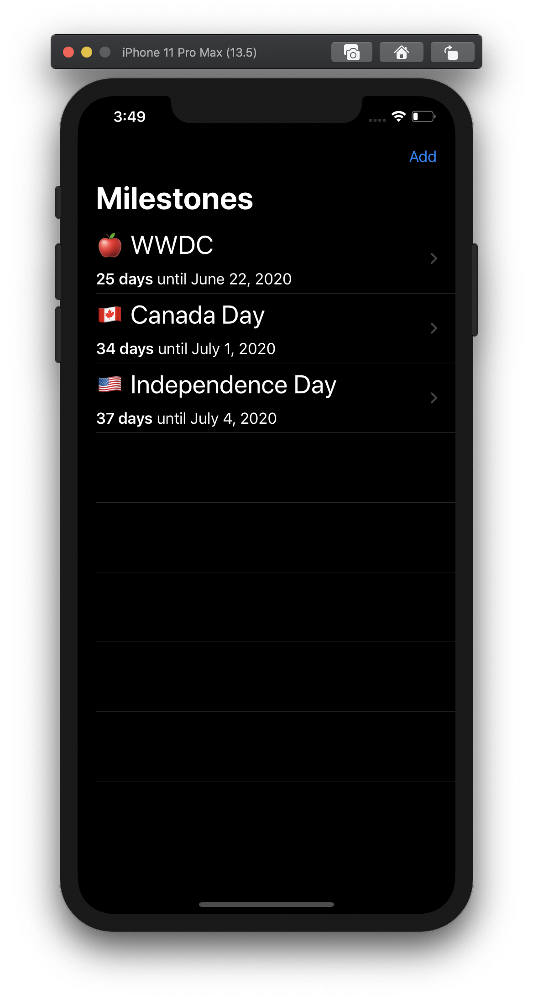
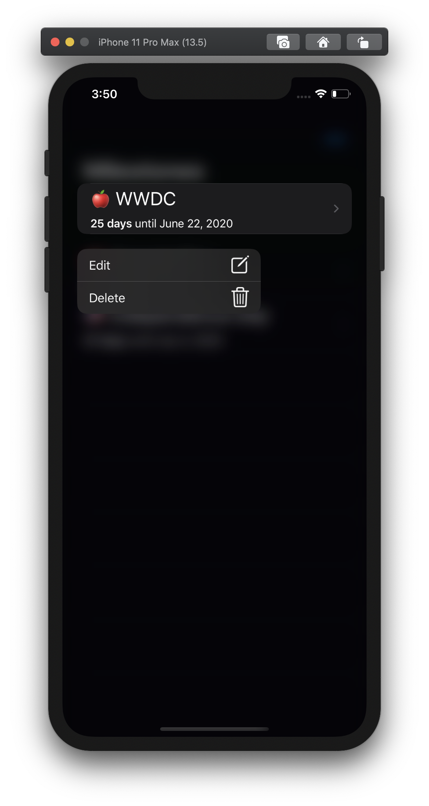
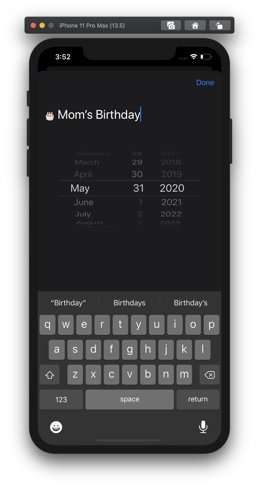
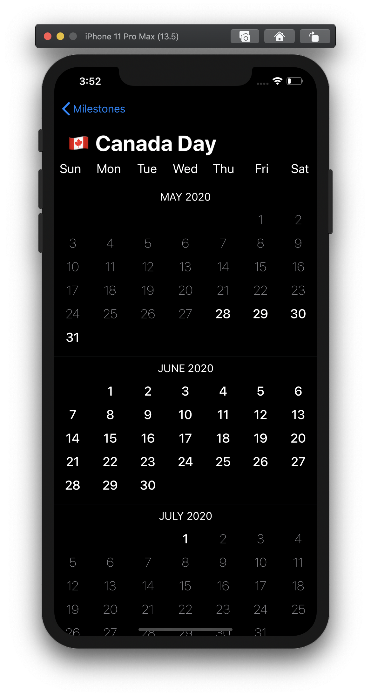
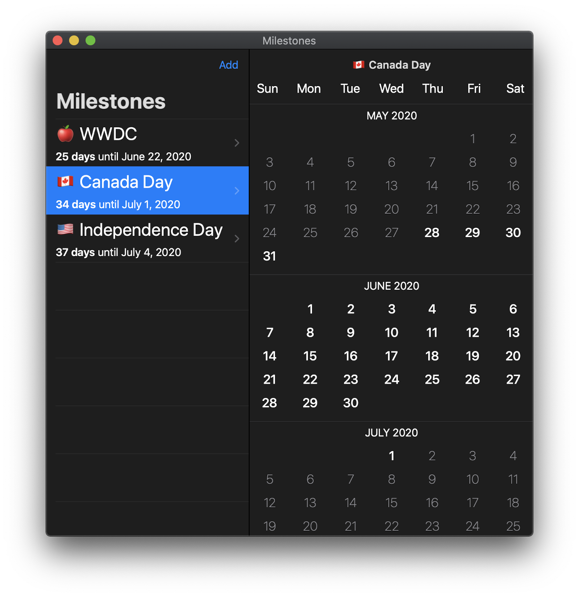

# Milestones

An app to count down the days until upcoming milestones. We all have something to look forward to.

Built to try out the [Swift Composable Architecture][tca], [SwiftUI][swiftui] and [Combine][combine].

| List | Context Menu | Edit | Calendar |
| ---- | ------------ | ---- | -------- |
|||||

## Building & Running

Tested with Xcode 12.2. Requires iOS 14.0 or later.

## Known Issues

Unfortunately SwiftUI is still buggy as of iOS 14.2. Here are some of the issues impacting this app
that I'm aware of:

1. [FB7736428][FB7736428]: Navigation bar buttons are sometimes unresponsive after dismissing the edit modal.
2. No way to programmatically make `TextField` the first responder without resorting to `UITextField` (mitigated).

## Credits

The videos and library from [Point Free][point-free]. Highly recommend both.

The [RKCalendar][rkcalendar] project, which I used and incrementally modified for the calendar functionality.

The [SwiftUI-Introspect][introspect] library to fix bugs or address limitations in SwiftUI.

## License

MIT.

[tca]: https://github.com/pointfreeco/swift-composable-architecture
[swiftui]: https://developer.apple.com/xcode/swiftui/
[combine]: https://developer.apple.com/documentation/combine
[FB7736428]: https://gist.github.com/jpsim/9bea8715291850e0bc3c6042eee10db5
[point-free]: https://www.pointfree.co
[rkcalendar]: https://github.com/RaffiKian/RKCalendar
[introspect]: https://github.com/siteline/SwiftUI-Introspect
